<div align="center">
    
    <h1>js-i18n</h1>
</div>

**JavaScript/TypeScript i18n library support for VS Code**.
powered by [nabekou29/js-i18n-language-server](https://github.com/nabekou29/js-i18n-language-server).

[](https://marketplace.visualstudio.com/items?itemName=nabekou29.js-i18n) [](LICENSE)

## Features

- **Inline translation display** -- See translation values directly in your code
- **Translation diagnostics** -- Detect missing and unused translation keys
- **Completion** -- Auto-complete translation keys as you type
- **Hover** -- View all translation values by hovering over a key
- **Go to definition** -- Jump to the key definition in JSON translation files
- **Find references** -- Find all usages of a translation key in source code
- **Rename** -- Rename a translation key across all source and JSON files
- **Language switcher** -- Switch display language from status bar or command palette
- **Edit translations** -- Edit translation values from code actions or command palette
- **Copy key** -- Copy the translation key at cursor to clipboard
- **Delete unused keys** -- Remove translation keys not referenced in code
- **Key prefix / Namespace / Monorepo** -- Full support for complex project structures

## Demo

<!-- この動画は docs/videos/demo.mp4 をアップロードしたもの -->

https://github.com/user-attachments/assets/2495b3dd-830c-4af8-9688-2365c5c2a0f1

## Inline Translation Display

Translation values are displayed directly in your code, replacing the key text.

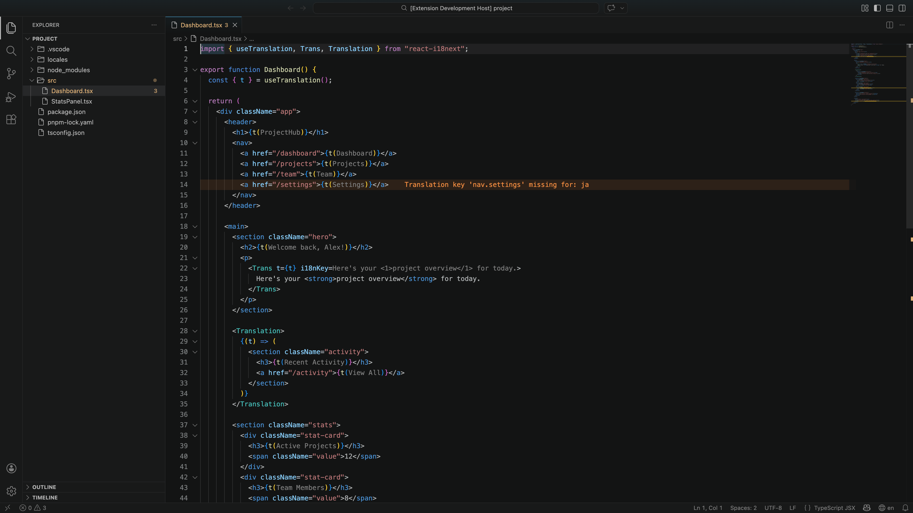

### Decoration Modes

Choose how translations are displayed via `js-i18n: Select Decoration Mode` command.

| Mode                           | Behavior                         | Cursor line                    | Screenshot                                                     |
| ------------------------------ | -------------------------------- | ------------------------------ | -------------------------------------------------------------- |
| **Replace + Inline** (default) | Key is replaced with translation | Shows translation to the right | 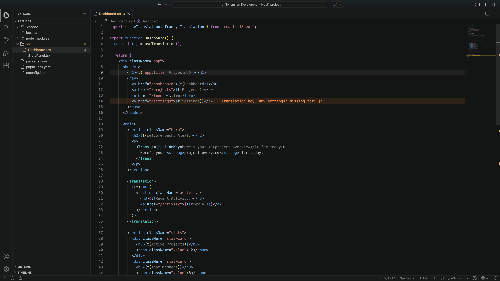 |
| **Replace + Hide**             | Key is replaced with translation | Hidden                         | 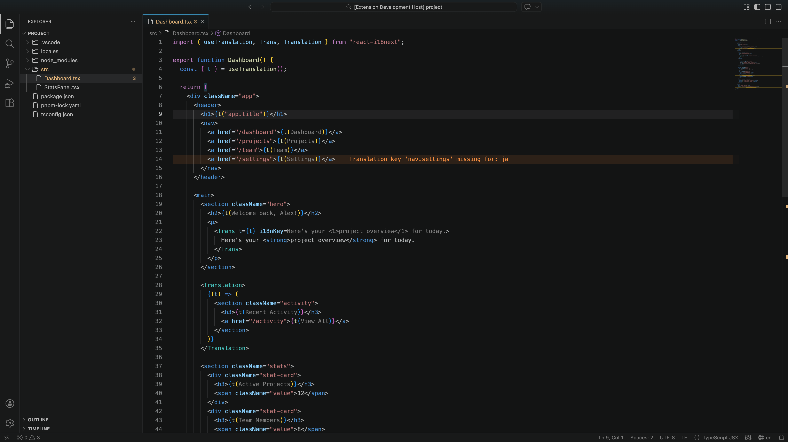     |
| **Inline**                     | Key stays visible                | Translation shown to the right | 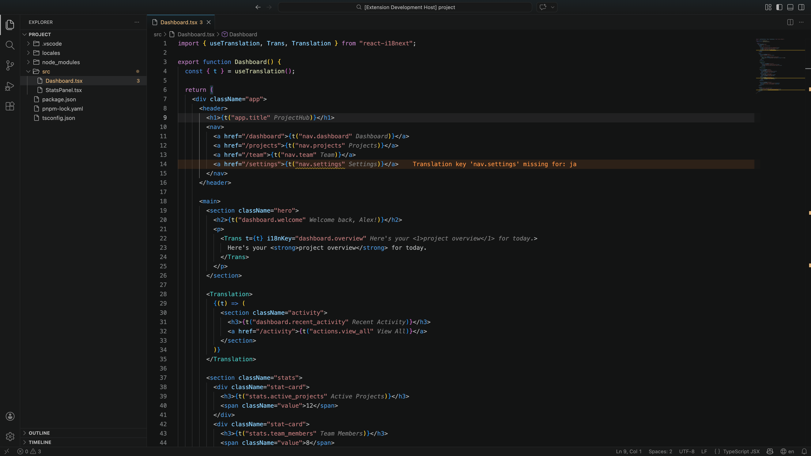                   |

## Code Intelligence

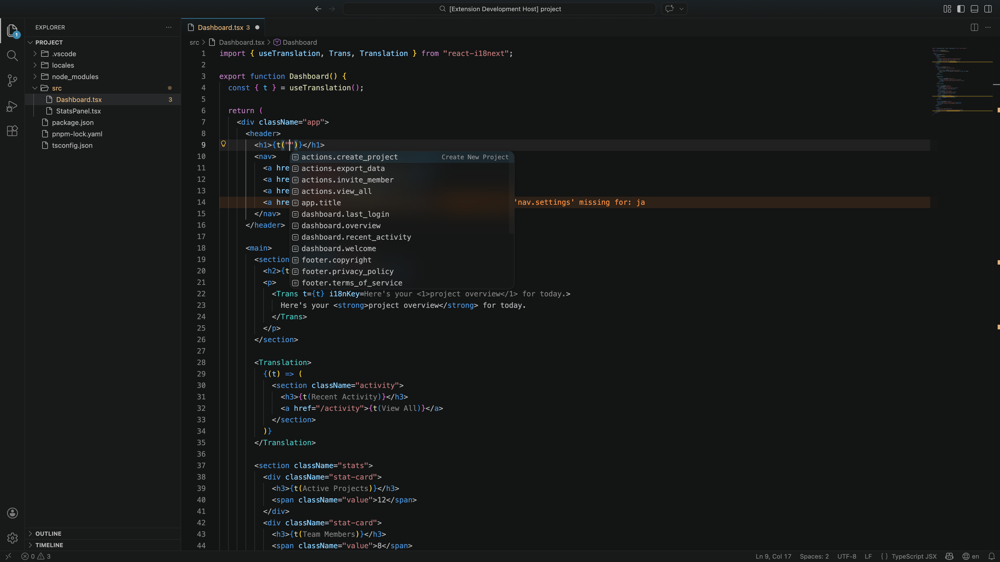

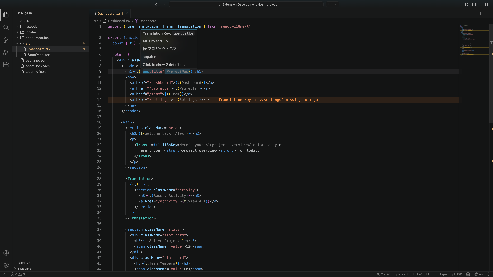

Translation keys are fully integrated with the editor's intelligence features:

- **Completion** -- Start typing inside `t("")` to see matching keys
- **Hover** -- View translations for all languages at a glance
- **Go to definition** -- Jump directly to the key in JSON translation files
- **Find references** -- Locate every usage of a key across your codebase
- **Rename** -- Rename a key across all source and translation files at once

## Translation Diagnostics

| Type                     | Target                            | Default severity | Description                                                |
| ------------------------ | --------------------------------- | ---------------- | ---------------------------------------------------------- |
| **Missing translations** | Source files (`.tsx`, `.ts`, ...) | Warning          | Keys used in code but not translated for some languages    |
| **Unused translations**  | Translation files (`.json`)       | Hint             | Keys defined in JSON but not referenced by any source code |

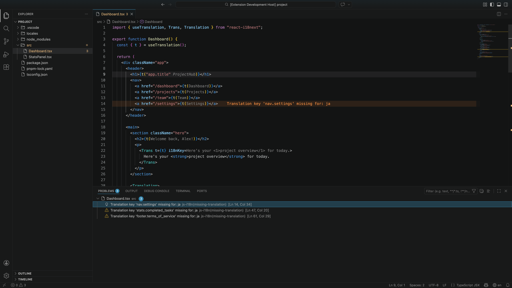

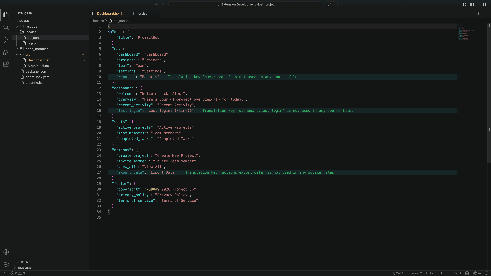

## Project Structure Support

### Namespace

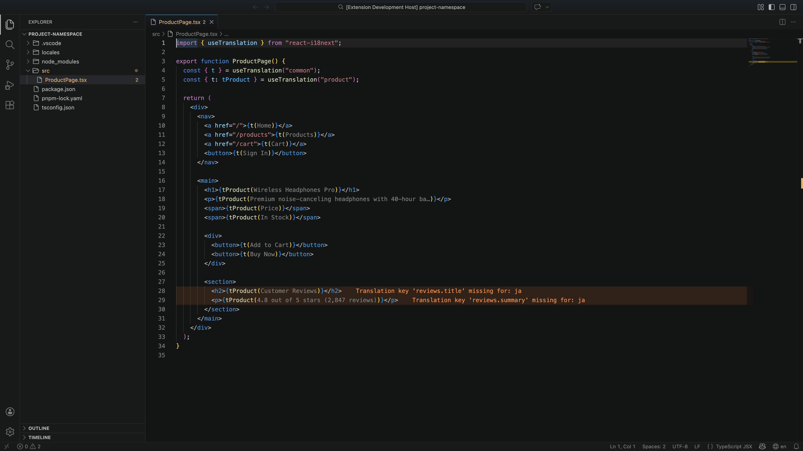

Multiple `useTranslation()` calls with different namespaces are fully supported. The same key name resolves to different values depending on the namespace.

### Key Prefix

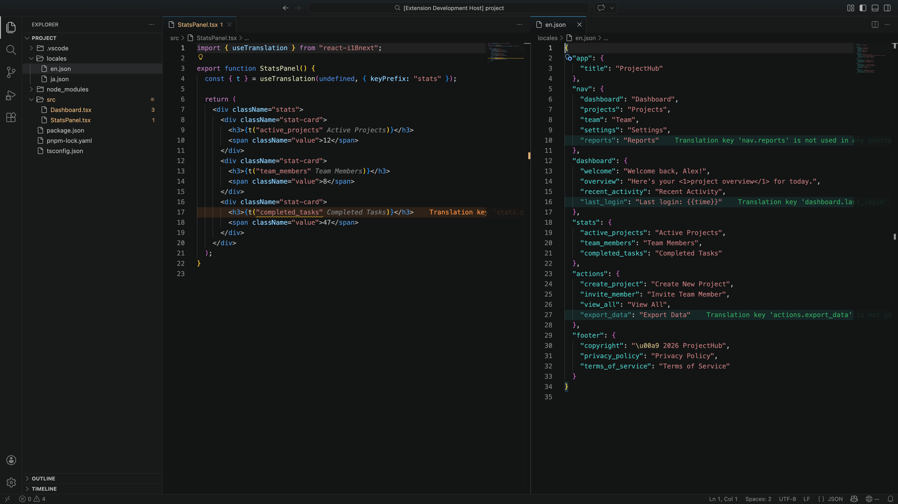

`useTranslation("ns", { keyPrefix: "stats" })` automatically prepends the prefix to all `t()` calls, reducing repetition in deeply nested translation structures.

### Monorepo

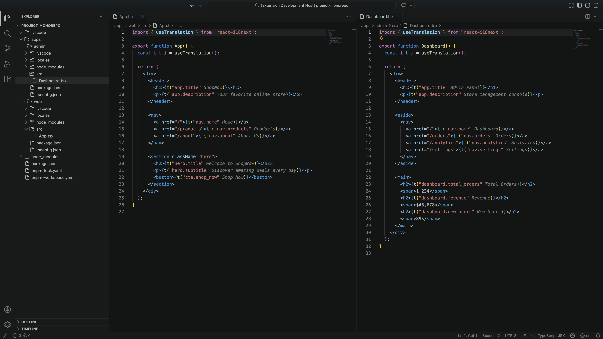

Automatic per-package server isolation based on `package.json` boundaries. The same key resolves to different translations in each package.

## Supported Libraries

- [i18next](https://www.i18next.com/) / [react-i18next](https://react.i18next.com/)
- [next-intl](https://next-intl-docs.vercel.app/)
- [react-intl](https://formatjs.io/docs/react-intl/)

### Supported Syntax

```tsx
// Function hooks
const { t } = useTranslation()
const { t } = useTranslation("namespace")
const { t } = useTranslation("namespace", { keyPrefix: "section" })
const t = useTranslations()          // next-intl
const t = useTranslations("namespace")

// Translation calls
t("key")
t("nested.key.path")
t("key", { count: 1 })

// JSX components
<Trans i18nKey="key" />
<Translation>{(t) => <span>{t("key")}</span>}</Translation>
```

## Requirements

The language server binary is bundled with the extension -- no manual installation needed.

To use a custom build, set `js-i18n.serverPath` or install via:

```bash
cargo install js-i18n-language-server
```

## Configuration

| Setting                                                    | Default                               | Description                                                    |
| ---------------------------------------------------------- | ------------------------------------- | -------------------------------------------------------------- |
| `js-i18n.serverPath`                                       | `null`                                | Path to `js-i18n-language-server` binary                       |
| `js-i18n.translationFiles.includePatterns`                 | `["**/{locales,messages}/**/*.json"]` | Glob patterns for translation files                            |
| `js-i18n.translationFiles.excludePatterns`                 | `[]`                                  | Glob patterns to exclude                                       |
| `js-i18n.includePatterns`                                  | `["**/*.{js,jsx,ts,tsx}"]`            | Source file glob patterns                                      |
| `js-i18n.excludePatterns`                                  | `["node_modules/**"]`                 | Source file exclusion patterns                                 |
| `js-i18n.keySeparator`                                     | `"."`                                 | Separator for nested translation keys                          |
| `js-i18n.namespaceSeparator`                               | `null`                                | Separator between namespace and key                            |
| `js-i18n.defaultNamespace`                                 | `null`                                | Default namespace when none is specified                       |
| `js-i18n.primaryLanguages`                                 | `null`                                | Fallback language priority                                     |
| `js-i18n.decoration.enabled`                               | `true`                                | Enable inline translation display                              |
| `js-i18n.decoration.maxLength`                             | `50`                                  | Max display length for inline translation                      |
| `js-i18n.decoration.mode`                                  | `"replace"`                           | Display mode: `replace` or `inline`                            |
| `js-i18n.decoration.cursorLine`                            | `"inline"`                            | Cursor line behavior: `hide` or `inline`                       |
| `js-i18n.diagnostics.missingTranslation.enabled`           | `true`                                | Enable missing translation diagnostics                         |
| `js-i18n.diagnostics.missingTranslation.severity`          | `"warning"`                           | Severity level                                                 |
| `js-i18n.diagnostics.missingTranslation.requiredLanguages` | `null`                                | Only check these languages                                     |
| `js-i18n.diagnostics.missingTranslation.optionalLanguages` | `null`                                | Skip these languages                                           |
| `js-i18n.diagnostics.unusedTranslation.enabled`            | `true`                                | Enable unused translation diagnostics                          |
| `js-i18n.diagnostics.unusedTranslation.severity`           | `"hint"`                              | Severity level                                                 |
| `js-i18n.diagnostics.unusedTranslation.ignorePatterns`     | `[]`                                  | Key patterns to exclude from unused diagnostics                |
| `js-i18n.indexing.numThreads`                              | `null`                                | Parallel thread count for indexing (default: 40% of CPU cores) |

## License

MIT
