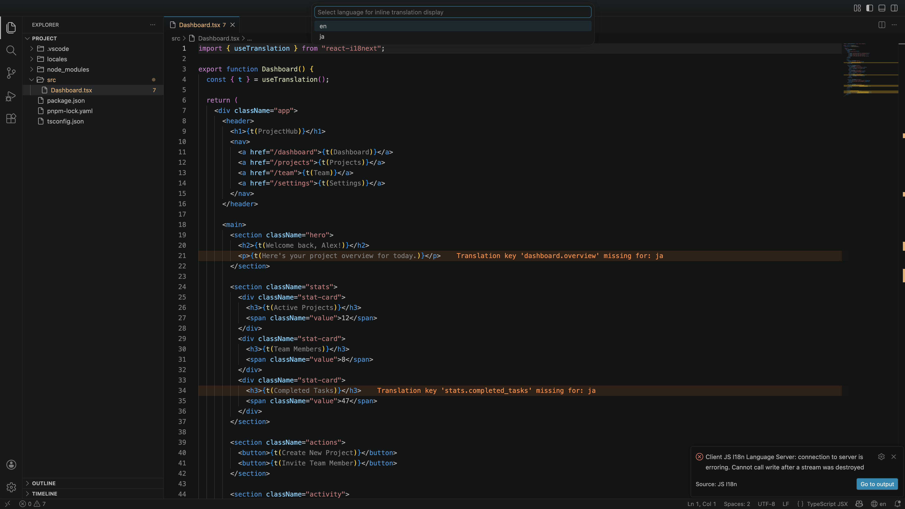

# JS I18n

i18next / next-intl / react-intl support for VS Code, powered by [js-i18n-language-server](https://github.com/user/js-i18n-language-server).

<video src="docs/videos/demo.mp4" autoplay loop muted playsinline></video>

## Features

### Inline Translation Display


See translation values directly in your code. The original key is replaced with the translated text, and reverts when the cursor is on that line.

#### Decoration Modes

<video src="docs/videos/decoration-modes.mp4" autoplay loop muted playsinline></video>

Choose how translations are displayed: **Replace** (default) swaps the key with the translation value, or **Inline** shows the value to the right of the key. On the cursor line, the translation can be shown inline or hidden entirely.

### Translation Diagnostics

#### Missing Translations


Get warnings in your source code when translations are missing for specific languages. Configurable severity and language filtering.

#### Unused Translations


Find translation keys in your JSON files that are no longer referenced by any source code. Helps keep translation files clean.

### Language Switcher



Switch the display language from the status bar or command palette.

### More Features

- **Edit translations** -- Edit translation values directly from code actions or command palette
- **Copy key** -- Copy the translation key at cursor to clipboard
- **Delete unused keys** -- Remove translation keys not referenced in code

### Key Prefix


`useTranslation({ keyPrefix: "stats" })` automatically prepends the prefix to all `t()` calls, reducing repetition in deeply nested translation structures.

### Namespace Support


Multiple `useTranslation()` calls with different namespaces are fully supported. The same key name resolves to different values depending on the namespace.

### Monorepo Support


Automatic per-package server isolation based on `package.json` boundaries. The same key resolves to different translations in each package.

## Requirements

[js-i18n-language-server](https://github.com/user/js-i18n-language-server) must be installed and available in your PATH, or configured via `jsI18n.serverPath`.

```bash
cargo install js-i18n-language-server
```

## Configuration

| Setting | Default | Description |
|---------|---------|-------------|
| `jsI18n.serverPath` | `null` | Path to `js-i18n-language-server` binary |
| `jsI18n.translationFiles.includePatterns` | `["**/{locales,messages}/**/*.json"]` | Glob patterns for translation files |
| `jsI18n.translationFiles.excludePatterns` | `[]` | Glob patterns to exclude |
| `jsI18n.includePatterns` | `["**/*.{js,jsx,ts,tsx}"]` | Source file glob patterns |
| `jsI18n.excludePatterns` | `["node_modules/**"]` | Source file exclusion patterns |
| `jsI18n.keySeparator` | `"."` | Separator for nested translation keys |
| `jsI18n.namespaceSeparator` | `null` | Separator between namespace and key |
| `jsI18n.defaultNamespace` | `null` | Default namespace when none is specified |
| `jsI18n.primaryLanguages` | `null` | Fallback language priority |
| `jsI18n.decoration.enabled` | `true` | Enable inline translation display |
| `jsI18n.decoration.maxLength` | `50` | Max display length for inline translation |
| `jsI18n.decoration.mode` | `"replace"` | Display mode: `replace` or `inline` |
| `jsI18n.decoration.cursorLine` | `"inline"` | Cursor line behavior: `hide` or `inline` |
| `jsI18n.diagnostics.missingTranslation.enabled` | `true` | Enable missing translation diagnostics |
| `jsI18n.diagnostics.missingTranslation.severity` | `"warning"` | Severity level |
| `jsI18n.diagnostics.unusedTranslation.enabled` | `true` | Enable unused translation diagnostics |
| `jsI18n.diagnostics.unusedTranslation.severity` | `"hint"` | Severity level |

## Supported Libraries

- [i18next](https://www.i18next.com/) / [react-i18next](https://react.i18next.com/)
- [next-intl](https://next-intl-docs.vercel.app/)
- [react-intl](https://formatjs.io/docs/react-intl/)

## License

MIT
